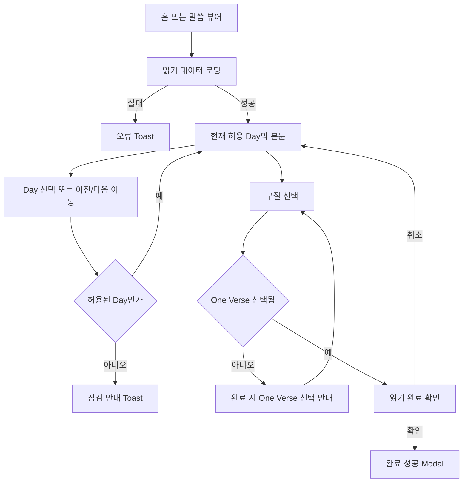
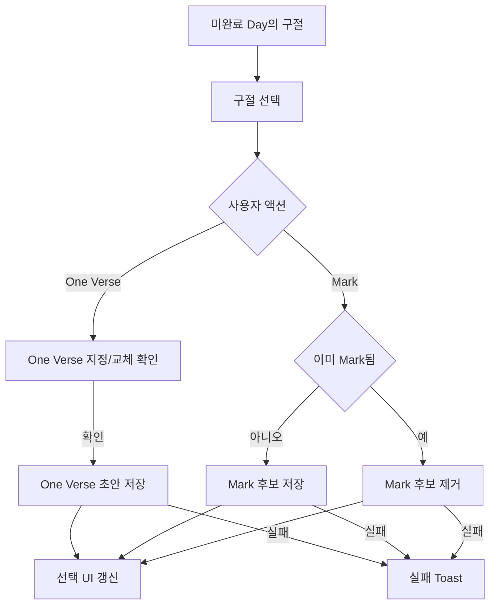
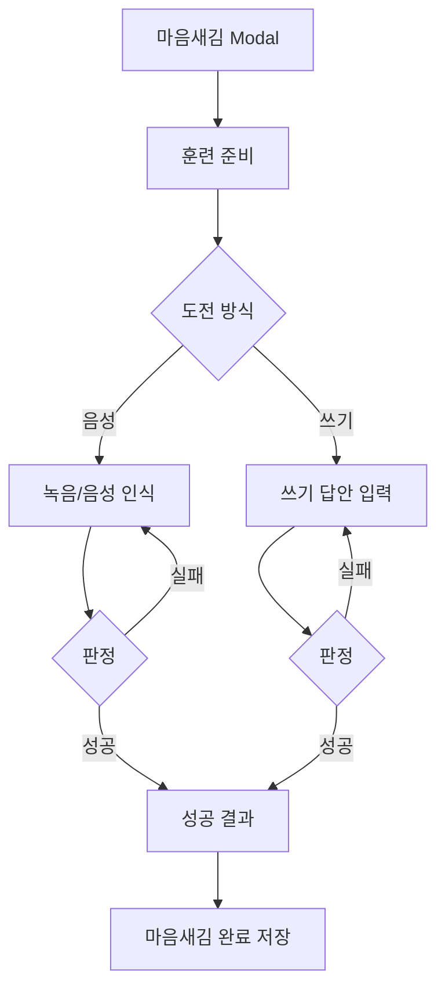
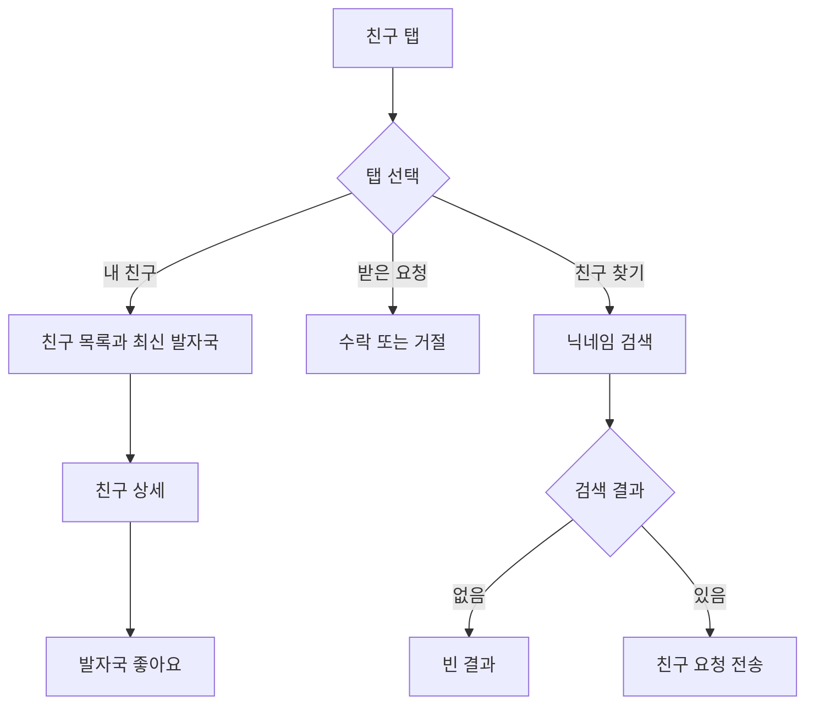
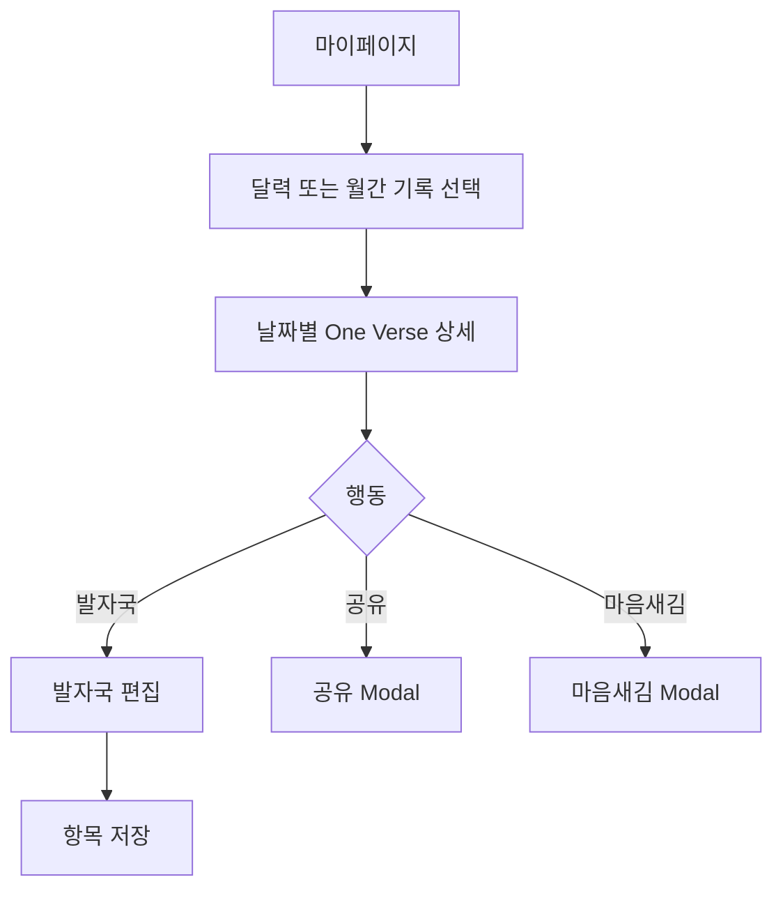

# One Verse User Journeys

## Journey 01 — 오늘의 말씀 읽기와 완료

**목표:** 허용된 Day의 4트랙을 읽고 완료 기록을 남긴다.  
**진입점:** 홈의 읽기 CTA, 하단 말씀 뷰어 탭.  
**완료 조건:** One Verse가 있는 상태에서 완료 확인을 통과한다.

## Journey 02 — One Verse와 Mark 관리

**목표:** 오늘 남길 한 구절을 정하고, 별도 후보 구절을 Mark한다.  
**진입점:** 말씀 뷰어의 본문 구절.  
**완료 조건:** One Verse 초안 또는 Mark 후보 저장 성공.

## Journey 03 — 마음새김

**목표:** One Verse를 음성 또는 쓰기로 훈련한다.  
**진입점:** 읽기 완료 구절, 마이페이지/날짜 상세의 마음새김 행동.  
**완료 조건:** 훈련 성공 후 완료 처리.

## Journey 04 — 친구와 발자국

**목표:** 친구를 찾거나 친구의 말씀 기록을 보고 좋아요를 남긴다.  
**진입점:** 친구 탭, 친구 요청 badge.  
**완료 조건:** 요청 전송/응답 또는 좋아요 처리.

## Journey 05 — 개인 기록 회고와 발자국 작성

**목표:** 과거 One Verse를 찾고 발자국을 작성·공유·훈련한다.  
**진입점:** 마이페이지 달력/월간 목록, 읽기 화면.  
**완료 조건:** 발자국 저장 또는 공유 요청 실행.

