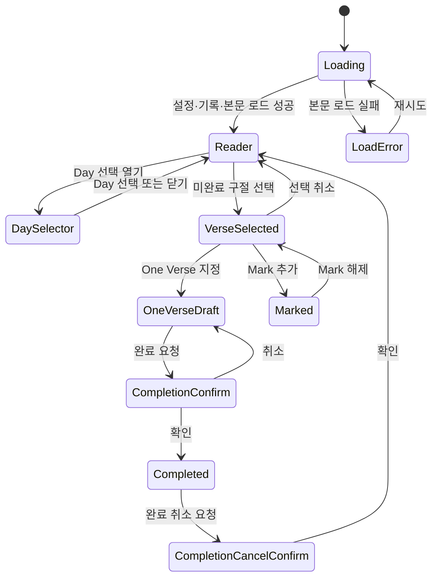
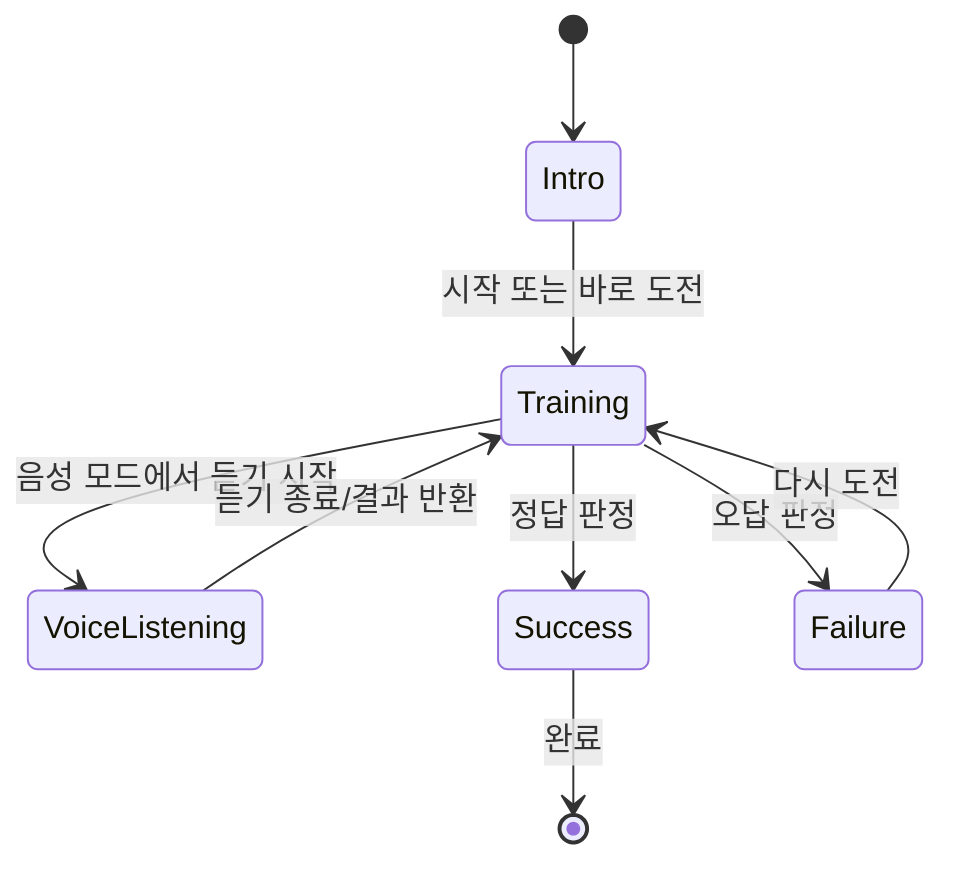
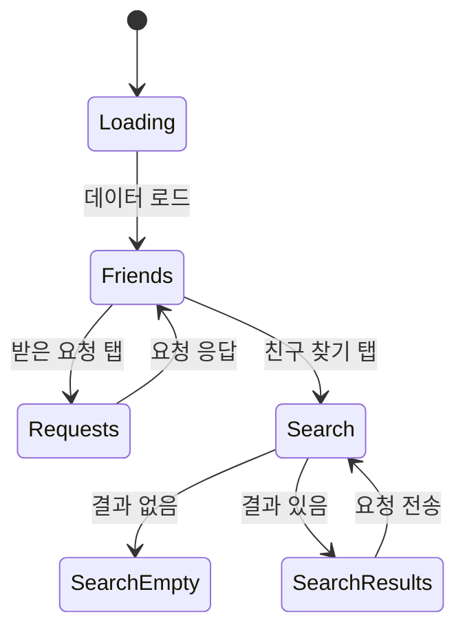
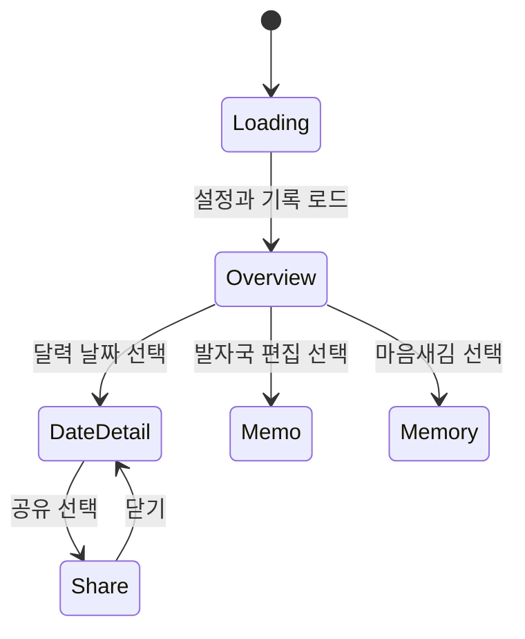

# One Verse Screen States

## 말씀 뷰어

| State | 진입 조건 | 주요 UI | 가능한 Action | 다음 State |
|---|---|---|---|---|
| Loading | 화면 진입/Day 변경 | 로딩 화면 | 없음 | Reader, LoadError |
| Reader | 데이터와 본문 로드 | 고정 헤더, 트랙, 본문 스크롤 | Day 이동, 구절 선택 | DaySelector, VerseSelected |
| DaySelector | Day 버튼 | 일정 시트, 잠김 Day | Day 선택/닫기 | Reader |
| VerseSelected | 미완료 구절 클릭 | One Verse / Mark 액션 | 지정, Mark 토글 | OneVerseDraft, Marked |
| OneVerseDraft | One Verse 저장 | One Verse 배지, 완료 CTA | 재선택, 완료 | CompletionConfirm |
| Completed | 완료 저장 성공 | 완료 상태/취소 경로 | 마음새김, 완료 취소 | CompletionCancelConfirm |

`useActiveReaderTrack`와 퀵 이동은 문서 스크롤이 아니라 `#bible-content-scroll`을 기준으로 작동한다.

## 마음새김 Modal

| State | 진입 조건 | 주요 UI | 가능한 Action | 다음 State |
|---|---|---|---|---|
| Intro | Modal 열기 | One Verse, 음성, 속도, 시작 | 시작/바로 도전 | Training |
| Training | 훈련 시작 | 단계/진행/쓰기 또는 음성 UI | 답안 입력, 녹음 | VoiceListening, Success, Failure |
| VoiceListening | 음성 듣기 시작 | 녹음 중지 UI | 중지 | Training |
| Failure | 판정 실패 | 실패 결과·재도전 | 다시 도전 | Training |
| Success | 판정 성공 | 성공 결과 | 확인 | 종료 |

## 친구 화면

| State | 진입 조건 | 주요 UI | 가능한 Action | 다음 State |
|---|---|---|---|---|
| Loading | 친구 화면 진입 | 목록 skeleton | 없음 | Friends |
| Friends | 기본 탭 | 친구/최신 발자국 | 상세 열기, 좋아요 | Requests, Search |
| Requests | 요청 탭 | 수신 요청 | 수락/거절 | Friends |
| Search | 검색 탭 | 입력·검색 | 검색 | SearchEmpty, SearchResults |
| SearchEmpty | 검색 결과 없음 | 빈 결과 메시지 | 검색어 변경 | Search |

## 마이페이지

| State | 진입 조건 | 주요 UI | 가능한 Action | 다음 State |
|---|---|---|---|---|
| Loading | 화면 진입 | 로딩 표시 | 없음 | Overview |
| Overview | 기록 로드 | 고정 헤더, 달력, 월간 요약 | 날짜/발자국/공유/훈련 | DateDetail, Memo, Memory |
| DateDetail | 날짜 선택 | 해당 날짜 One Verse 목록 | 공유, 마음새김 | Share, Memory |
| Memo | 발자국 진입 | 항목 편집/저장 | 저장/뒤로 | Overview 또는 DateDetail |
